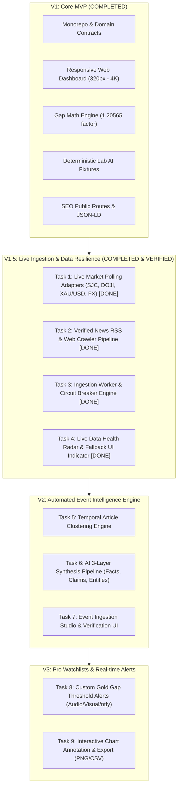

# FrabPulse — Detailed Product Milestones, Specifications & Task Breakdown

> **Document Status**: Approved Architecture Roadmap  
> **Author**: Founding Principal Engineer & Architect  
> **Target System**: FrabPulse (`apps/api`, `apps/web`, `packages/shared`)  
> **Operating Standard**: [docs/AGENT_PROTOCOL.md](./AGENT_PROTOCOL.md)

---

## 1. Executive Roadmap Overview

FrabPulse is transitioning from **V1 (Bootstrap & Responsive Experience)** to **V1.5 (Live Ingestion & Data Resilience)**, **V2 (Automated Event Intelligence & Clustering)**, and **V3 (Watchlists & Pro Alerts)**.



---

## 2. Milestone V1.5 — Live Ingestion & Data Resilience Engine

### 2.1 Why this milestone exists (Problem & Value)
- **Current Limitation**: Prices and news currently rely on deterministic seed fixtures with simulated timer jitter. While excellent for offline development and testing, FrabPulse cannot fulfill its promise of *"Real-time Event Intelligence"* without ingesting actual market ticks and accredited news reports.
- **Goal**: Connect live domestic gold feeds (SJC, DOJI, PNJ), international spot gold (XAU/USD), commercial bank foreign exchange rates (Vietcombank / SBV USD/VND), and verified Vietnamese & international news feeds (VnExpress, Tuoi Tre, Kitco, Reuters).
- **Core Requirement**: **Zero Single-Point-of-Failure (SPOF)**. If an external website changes its HTML or an API rate limits, the system must gracefully fall back to cached database states with clear data health timestamps, never crashing or displaying broken UI.

---

### 2.2 Task Breakdown for Milestone V1.5

#### [Task 1.5.1] Live Market Data Providers & Currency Exchange Adapters [COMPLETED - commit 923a48d]
- **Objective**: Implement concrete, production-grade market data adapters behind `IMarketDataProvider` interface for domestic gold, global spot gold, and foreign exchange rates.
- **Target Modules & Files**:
  - `packages/shared/src/domain.ts` (extended provider status & freshness types)
  - `apps/api/src/market-data/providers/sjc-live.provider.ts` (SJC public XML/JSON endpoint)
  - `apps/api/src/market-data/providers/gold-api-spot.provider.ts` (XAU/USD live spot feed)
  - `apps/api/src/market-data/providers/sbv-fx.provider.ts` (SBV/VCB USD/VND exchange rates)
  - `apps/api/src/market-data/market-data.service.ts` (provider aggregation & priority failover)
- **Dependencies**: `@frabpulse/shared`, NestJS `HttpModule` (Axios)
- **Acceptance Criteria**:
  1. Domestic SJC provider fetches official buy/sell quotes in VND/lượng.
  2. Spot gold provider fetches international XAU/USD in USD/oz.
  3. FX provider fetches official commercial transfer rate USD/VND.
  4. Math engine dynamically computes the exact Vietnam vs. World Gold Gap with fresh inputs.
  5. If live provider fails or times out (5000ms), fallback seamlessly to last known good DB snapshot without throwing unhandled exceptions.
- **Verification Method**: Unit tests with mock responses + live integration test asserting valid positive numeric prices and gap computation.

---

#### [Task 1.5.2] Verified News Pipeline & Multi-Source RSS Ingestion [COMPLETED - commit 6c07fef]
- **Objective**: Ingest accredited financial journalism and regulatory news articles from RSS feeds and canonical web sources with automated deduplication.
- **Target Modules & Files**:
  - `apps/api/src/news/providers/rss-feed.provider.ts` (VnExpress Kinh Doanh, Tuoi Tre Tài Chính, Kitco Gold News RSS)
  - `apps/api/src/news/deduplication.service.ts` (Normalized URL hash + Levenshtein / Jaccard title similarity check)
  - `apps/api/src/news/news.service.ts` (Stream ingestion, publisher credibility weights)
- **Dependencies**: `fast-xml-parser` or native fetch XML parser (zero bulky dependencies)
- **Acceptance Criteria**:
  1. Ingestion parses RSS 2.0 and Atom feeds cleanly.
  2. Deduplication rejects articles with matching canonical URLs or >85% title similarity within 24 hours.
  3. Every article is tagged with publisher credibility rating (`REUTERS: 0.95`, `BLOOMBERG: 0.95`, `VNEXPRESS: 0.90`, `TUOI_TRE: 0.88`, `KITCO: 0.90`).
  4. Clean markdown / plaintext snippet extraction without HTML script or style tags.
- **Verification Method**: Dedicated Vitest suite `news-ingestion.spec.ts` testing RSS parsing and duplicate rejection.

---

#### [Task 1.5.3] Ingestion Worker, Scheduler & Circuit Breaker [COMPLETED - commit fc2f69e]
- **Objective**: Establish background scheduled polling with exponential backoff and circuit breaker protection to prevent rate-limiting or blocking.
- **Target Modules & Files**:
  - `apps/api/src/market-data/market-data.scheduler.ts` (Cron: Market hours vs. Closed hours)
  - `apps/api/src/common/circuit-breaker.ts` (Tripping states: CLOSED, OPEN, HALF-OPEN)
  - `apps/api/src/sse/pulse.broadcaster.ts` (Broadcast real ticks over SSE only when price genuinely changes)
- **Dependencies**: `@nestjs/schedule`
- **Acceptance Criteria**:
  1. Polling interval adapts: Every 60s during trading hours (08:00 - 17:00 ICT for domestic gold; 24/5 for spot gold), every 15 minutes during off-hours.
  2. 3 consecutive network failures trigger OPEN state on circuit breaker, pausing external requests for 5 minutes and serving cached DB data.
  3. Emits live tick event to `/api/v1/sse/pulse` only when price delta $\neq 0$.
- **Verification Method**: Circuit breaker state transition tests under simulated network drops.

---

#### [Task 1.5.4] Data Freshness UI, Health Radar & Source Provenance [COMPLETED - commit f55da91]
- **Objective**: Provide absolute transparency in the web dashboard regarding data origin, last update timestamp, and fallback indicators.
- **Target Modules & Files**:
  - `apps/web/src/components/dashboard/MarketHealthBadge.tsx` (Live vs. Cached vs. Offline)
  - `apps/web/src/components/dashboard/AssetPriceCard.tsx` (Timestamp of last tick + source logo)
  - `apps/web/src/components/dashboard/DashboardClient.tsx` (Real-time reconnection status banner)
- **Dependencies**: Lucide icons, Tailwind CSS
- **Acceptance Criteria**:
  1. Shows discrete status pills: `LIVE FEED` (green pulse), `CACHED` (amber clock), or `RECONNECTING` (subtle spinner).
  2. Relative human-readable timestamp (e.g., "Updated 12s ago") with absolute UTC/ICT tooltip.
  3. Accessible screen-reader live region (`aria-live="polite"`).
  4. Respects mobile viewport (320px) without layout overflow or badge wrapping.
- **Verification Method**: Playwright/Vitest component test simulating stale and live SSE signals.

---

## 3. Milestone V2 — Automated Event Intelligence & 3-Layer Synthesis

### 3.1 Why this milestone exists
- **Core Thesis**: FrabPulse connects **events** + **trustworthy sources** + **changing data over time**.
- **Goal**: When multiple accredited outlets report on the same economic development (e.g., "State Bank of Vietnam meets to amend Decree 24" or "Fed signals delayed cuts"), the system automatically clusters articles, computes the asset movement window ($-30\text{m}$ to $+30\text{m}$), and synthesizes a non-hallucinatory intelligence brief.

---

### 3.2 Task Breakdown for Milestone V2

#### [Task 2.1] Temporal Article Clustering Engine
- **Objective**: Group individual news dispatches into unified `MarketEvent` candidates based on entity matching, keyword co-occurrence, and temporal proximity ($\Delta t \le 6\text{h}$).
- **Target Modules & Files**:
  - `apps/api/src/events/clustering.service.ts`
  - `apps/api/src/events/events.service.ts`
  - `packages/shared/src/domain.ts` (Event clustering thresholds)
- **Acceptance Criteria**:
  1. Groups at least 2 distinct articles discussing the same topic into a single candidate event.
  2. Generates deterministic topic taxonomy tags (`CENTRAL_BANK`, `VIETNAM_REGULATION`, `GEOPOLITICS`, `INFLATION`, `USD_DXY`).
  3. Computes multi-source agreement index ($S_{\text{consensus}} \in [0, 1]$).

---

#### [Task 2.2] Structured AI Synthesis Pipeline (Strict Non-Hallucinatory Guardrails)
- **Objective**: Run multi-source articles through `IAIIntelligenceProvider` with strict JSON schema output enforcing the 3 epistemological layers.
- **Target Modules & Files**:
  - `apps/api/src/ai/ai.service.ts`
  - `apps/api/src/ai/prompts/synthesis.prompt.ts`
  - `apps/api/src/events/correlation.service.ts`
- **Acceptance Criteria**:
  1. **Layer 1 (Facts)**: Pure mathematical price deltas within the event window.
  2. **Layer 2 (Sources)**: Explicit quotes and attributed claims mapped directly to publisher citations.
  3. **Layer 3 (AI Synthesis)**: Entity extraction, consensus points, and divergent perspectives. Zero ungrounded causal claims.

---

#### [Task 2.3] Interactive Event Timeline & Epistemic Verification Screen
- **Objective**: Deliver a web interface allowing users to explore how a story evolved across time and sources.
- **Target Modules & Files**:
  - `apps/web/src/app/events/[id]/page.tsx`
  - `apps/web/src/components/events/EpistemicBreakdownCard.tsx`
  - `apps/web/src/components/events/EventSourceComparisonMatrix.tsx`
- **Acceptance Criteria**:
  1. Clear visual distinction between Fact, Claim, and AI Summary (distinct color borders & iconography).
  2. Direct external links to original journalism sources with accredited publisher badges.
  3. Full mobile responsiveness with expandable source accordions.

---

## 4. Milestone V3 — Pro Watchlists & Gap Arbitrage Alerting

### 4.1 Why this milestone exists
- Traders, gold investors, and quantitative observers need proactive alerts when the domestic-to-international premium diverges past historic volatility bands (e.g. gap $> 18\text{M VND}$ or spreads widening past $3\text{M VND}$).

---

### 4.2 Task Breakdown for Milestone V3

#### [Task 3.1] Client-side Watchlist & Configurable Gap Thresholds
- **Objective**: Allow users to store asset watchlists and set custom gap alert thresholds stored securely in local browser storage without requiring mandatory user registration.
- **Target Modules & Files**:
  - `apps/web/src/hooks/useWatchlist.ts`
  - `apps/web/src/components/alerts/AlertConfigModal.tsx`
  - `packages/shared/src/domain.ts` (`AlertRule`, `ThresholdCondition`)

---

#### [Task 3.2] Multi-Channel Alert Dispatcher (Visual, Audio & Webhook/ntfy)
- **Objective**: Dispatch real-time alerts when SSE pulse ticks breach configured thresholds.
- **Target Modules & Files**:
  - `apps/web/src/components/alerts/RadarAlertBanner.tsx`
  - `apps/api/src/alerts/webhook.dispatcher.ts` (Telegram Bot & ntfy integration)

---

## 5. Implementation Sequence & Execution Priority

```text
┌────────────────────────────────────────────────────────────────────────┐
│                        EXECUTION TIMELINE                              │
├────────────┬───────────────────────────────────────────┬───────────────┤
│ Sequence   │ Task                                      │ Target Scope  │
├────────────┼───────────────────────────────────────────┼───────────────┤
│ Step 1     │ Task 1.5.1: Live Market Data Providers    │ apps/api      │
│ Step 2     │ Task 1.5.2: Verified News RSS Crawler     │ apps/api      │
│ Step 3     │ Task 1.5.3: Ingestion Worker & Scheduler  │ apps/api      │
│ Step 4     │ Task 1.5.4: Data Freshness Radar UI       │ apps/web      │
│ Step 5     │ Task 2.1 & 2.2: Automated Event Pipeline  │ api + shared  │
│ Step 6     │ Task 3.1 & 3.2: Watchlists & Gap Alerts   │ web + api     │
└────────────┴───────────────────────────────────────────┴───────────────┘
```

---

## 6. Verification & Quality Gates (Every Task Must Pass)

For every task executed under this specification, the agent must complete the full **Implementation Loop**:
1. `pnpm lint` (0 warnings, 0 errors).
2. `pnpm typecheck` (clean across `@frabpulse/shared`, `@frabpulse/tsconfig`, `@frabpulse/api`, `@frabpulse/web`).
3. `pnpm test` (all unit and integration tests passing).
4. `pnpm build` (production build successful).
5. Git commit with semantic commit message.
6. Dispatch verified completion alert to `https://ntfy.sh/haolx_AG_alert`.
