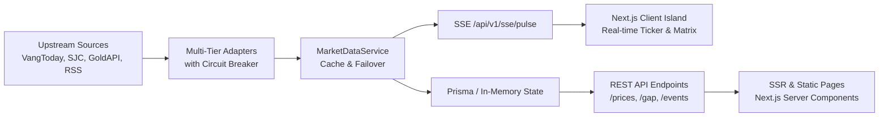

# FrabPulse — Project Architecture & Stable Context

**File**: \`docs/context/PROJECT.md\`  
**Status**: Authoritative Reference  
**Last Updated**: 2026-09-26  

---

## 1. Project Purpose & Domain Overview

**FrabPulse** is a real-time event intelligence and financial arbitrage radar connecting **market data movements**, **trustworthy source reports**, and **macro events over time**.

- **Frab = Frog + Lab** (Scientific experimentation, empirical facts, high precision)
- **Pulse = Market Heartbeat** (Detecting price deltas, news emergence, and arbitrage spreads)

### Key Domain Principles:
1. **The Vietnam Gold Gap (Domestic vs. World Arbitrage)**:
   - Domestic benchmark: SJC 9999 national bullion (traded in *lượng* / *cây* = 37.5 grams).
   - Global benchmark: Spot Gold (XAU/USD, quoted in troy ounces = 31.1034768 grams).
   - Conversion Constant: $1 \text{ lượng} = \frac{37.5}{31.1034768} \approx 1.20565 \text{ troy oz}$.
   - Formula:
     $$\text{World Price in VND} = \text{XAU/USD} \times \text{USD/VND} \times 1.20565$$
     $$\text{Gap (VND)} = \text{SJC Ask} - \text{World Price in VND}$$
     $$\text{Gap (\%)} = \frac{\text{Gap (VND)}}{\text{World Price in VND}} \times 100\%$$
2. **Three Epistemic Layers**:
   - **Layer 1: Observed Facts**: Mathematical price recordings, timestamps, spreads, deltas. Zero editorializing.
   - **Layer 2: Source Interpretations**: Direct quotes and attributed articles from accredited outlets (Reuters, Bloomberg, VnExpress).
   - **Layer 3: AI Synthesis**: Machine-extracted consensus and divergent arguments without hallucinated causation.

---

## 2. Tech Stack & Environment

- **Repository Structure**: Monorepo managed by **Turborepo** + **pnpm** (with npm/pnpm workspace compatibility).
- **Runtime**: Node.js >= 20.x, TypeScript 5.5+.
- **Backend (\`apps/api\`)**:
  - Framework: **NestJS 10.x** (modular architecture).
  - Data Streaming: **Server-Sent Events (SSE)** via \`rxjs\` Observable subjects.
  - Database ORM: **Prisma** with PostgreSQL adapter (graceful in-memory fallback when offline).
  - Scheduling: \`@nestjs/schedule\` cron tasks with Vietnam trading hours calendar.
  - Resilience: 3-state Circuit Breaker (\`CLOSED\`, \`OPEN\`, \`HALF_OPEN\`).
- **Frontend (\`apps/web\`)**:
  - Framework: **Next.js 15.5+** (App Router, Server Components + Client Islands).
  - Styling: **Tailwind CSS 3.4+** with dual theme system (\`darkMode: 'class'\`).
  - Icons: \`lucide-react\`.
  - Visualization: Custom high-performance SVG financial charts (Candlestick OHLC, Area, Spread Corridor, Crosshair).
- **Shared Package (\`packages/shared\`)**:
  - Core interfaces, DTOs, conversion formulas, and asset definitions compiled with \`tsup\`.

---

## 3. Directory Layout & Key Modules

```
FRABPULSE/
├── AGENTS.md                            # Primary agent entry point
├── apps/
│   ├── api/                             # NestJS API application
│   │   ├── src/
│   │   │   ├── main.ts                  # Nest bootstrap entry point
│   │   │   ├── app.module.ts            # Root application module
│   │   │   └── modules/
│   │   │       ├── market-data/         # Ingestion, failover, SSE, scheduler
│   │   │       │   ├── providers/       # SJC, GoldApi, Frankfurter, Mock
│   │   │       │   └── services/        # Circuit breaker, market data, scheduler
│   │   │       ├── news/                # RSS ingestion, deduplication engine
│   │   │       └── events/              # Event intelligence & correlation
│   │   └── test/                        # Vitest unit test suites
│   └── web/                             # Next.js 15 App Router web client
│       ├── src/
│       │   ├── app/                     # Routes: /, /gold, /events, /topics, /methodology
│       │   ├── components/
│       │   │   ├── chart/               # PriceEventChart (Candlestick, Area, Dual, MA20)
│       │   │   ├── dashboard/           # TickerTape, GoldGapCard, ProviderCard, AssetTableView
│       │   │   ├── theme/               # ThemeProvider, ThemeToggle
│       │   │   └── layout/              # Navbar, Footer, Mobile Drawer
│       │   └── lib/api-client.ts        # Typed fetch client to NestJS backend
│       └── test/                        # Vitest responsive & UI unit tests
├── packages/
│   ├── shared/                          # Domain models, formulas, asset definitions
│   └── tsconfig/                        # Shared TypeScript presets
├── docs/
│   ├── AGENT_PROTOCOL.md                # 18-point behavioral protocol
│   ├── context/                         # Active context continuity ledger
│   └── superpowers/specs/               # Architectural specifications
└── .agents/skills/                      # Curated frontend, react, and taste skills
```

---

## 4. Main Data Flow



---

## 5. Standard Verification Commands

Always run these commands from the repository root:

- **Install Dependencies**:
  \`\`\`bash
  pnpm install  # or npm install
  \`\`\`
- **Development Servers** (starts API at `:3001` and Web at `:3000`):
  \`\`\`bash
  npm run dev
  \`\`\`
- **Typecheck** (runs \`tsc --noEmit\` across all monorepo packages):
  \`\`\`bash
  npm run typecheck
  \`\`\`
- **Unit & Integration Tests** (Vitest across all 3 packages):
  \`\`\`bash
  npm run test
  \`\`\`
- **Production Build** (compiles shared, builds NestJS and Next.js SSG/SSR):
  \`\`\`bash
  npm run build
  \`\`\`
- **Lint**:
  \`\`\`bash
  npm run lint
  \`\`\`

---

## 6. Coding Conventions & Invariants

1. **Strict TypeScript**: All inputs and outputs must be strongly typed. No \`any\` types.
2. **Formula Integrity**: Conversion factor between Lượng and Oz is fixed at exactly $1.20565$. Never hardcode arbitrary conversion offsets.
3. **Dual Theme First**: All UI components must declare high-contrast classes for both Light Mode (\`bg-white\`, \`text-slate-900\`, \`border-slate-200\`) and Dark Mode (\`dark:bg-pulse-900\`, \`dark:text-white\`, \`dark:border-pulse-800\`).
4. **Mobile Ergonomics**: Interactive targets must maintain a minimum touch area of $44 \times 44\text{px}$.
5. **Epistemological Guardrail**: Never generate ungrounded causal assertions (e.g. state "observed shift coincided with event", not "event caused gold to plunge").
6. **Graceful Degradation**: When external networks or PostgreSQL are offline, services must fall back deterministically to mock fixtures without crashing.
